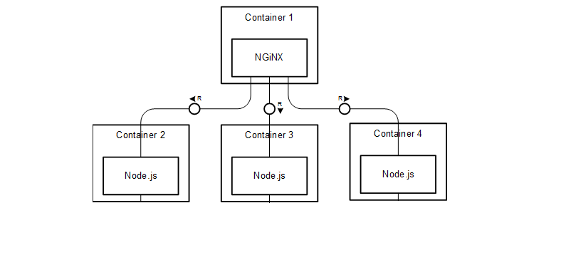

# Digital-Complaints-Management

### Our AWS EC2 Instance

## What is DCM?
Digital Complaints Management is a human resouce application where employees can write any complaints, concerns or inquiries they may have and get it resolved. Our main purpose is to improve communication between HR and employee. 

## Features
These are some of the features we implemented in DCM:
-[x] Authentication with register, sign in and sign out
-[x] Authentication with google login
-[x] Posting complaints, concerns, and inquiries
-[x] Employees can view all their complaints
-[x] HR can view all the complaints in database
-[x] HR can resolve any complaints
